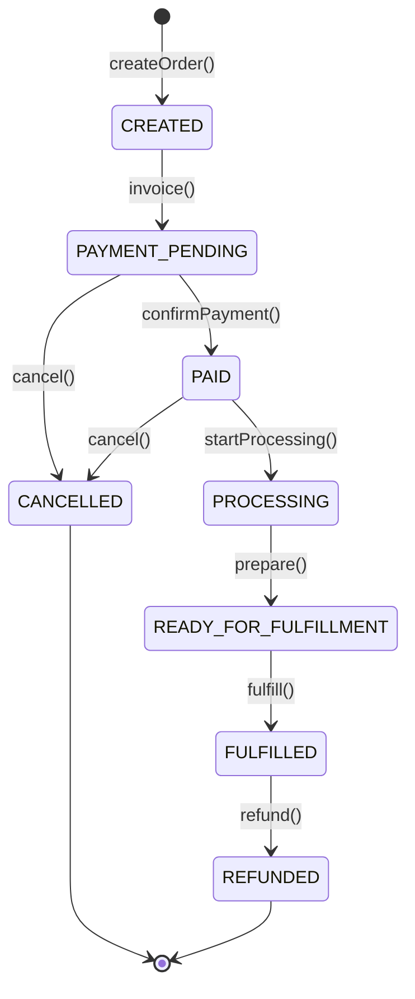
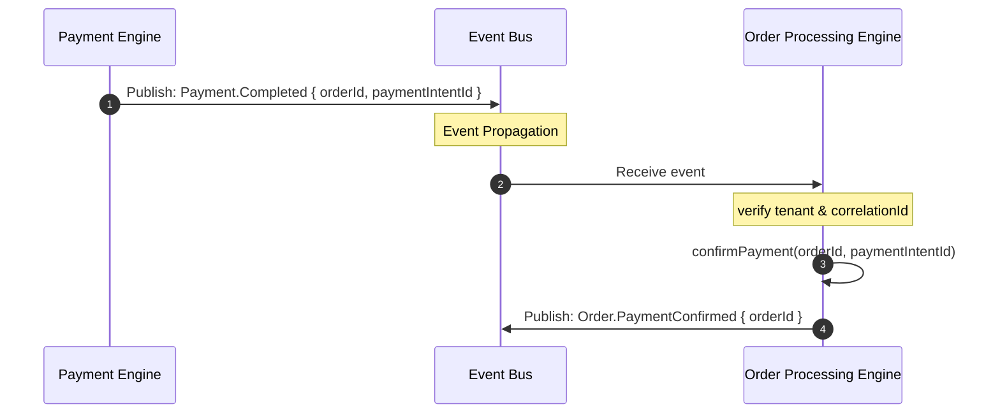

# SPRINT 4: COMMERCE RUNTIME
## Specyfikacja Kontraktu — 03_ORDER_PROCESSING_ENGINE.md
*Definicja silnika procesowania zamówień (Order Processing Engine), maszyny stanów zamówienia oraz integracji asynchronicznej z silnikiem płatności.*

---

### 1. Rozszerzona Maszyna Stanów Zamówienia (Order State Machine)

Cykl życia zamówienia w systemie WEB FACTOR wspiera kompletny proces realizacji i obsługuje stany pośrednie:



#### Opis Stanów:
1. **CREATED**: Zamówienie utworzone w pamięci, czekające na zainicjowanie procesu płatności.
2. **PAYMENT_PENDING**: Wygenerowano intencję płatności, oczekiwanie na autoryzację bramki.
3. **PAID**: Płatność potwierdzona przez webhook bramki (`Payment.Completed`).
4. **PROCESSING**: Zamówienie w trakcie kompletacji w magazynie.
5. **READY_FOR_FULFILLMENT**: Spakowane, gotowe do wygenerowania etykiety kurierskiej.
6. **FULFILLED**: Wysłane do klienta końcowego.
7. **CANCELLED**: Anulowane przed wysyłką (zwolnienie blokad magazynowych).
8. **REFUNDED**: Środki zwrócone kupującemu, transakcja wycofana.

---

### 2. Rozszerzona Domena Zamówienia (Order Domain Model)

Każde zamówienie musi być trwale przypisane do tenanta (`tenantId`) oraz klienta (`customerId`).

```typescript
export type OrderState = 
  | 'CREATED' 
  | 'PAYMENT_PENDING' 
  | 'PAID' 
  | 'PROCESSING' 
  | 'READY_FOR_FULFILLMENT' 
  | 'FULFILLED' 
  | 'CANCELLED' 
  | 'REFUNDED';

export interface OrderItem {
  productId: string;
  quantity: number;
  unitPriceGross: number;
  totalGross: number;
}

export interface ShippingDetails {
  fullName: string;
  street: string;
  city: string;
  zipCode: string;
  country: string;
}

export interface Order {
  id: string;
  tenantId: string;
  customerId: string;
  items: OrderItem[];
  subtotalGross: number;
  taxTotal: number;
  grandTotalGross: number;
  currency: string;
  paymentIntentId?: string;
  status: OrderState;
  shippingAddress: ShippingDetails;
  createdAt: string;
  updatedAt: string;
}
```

---

### 3. Asynchroniczna Integracja z Payment Engine

Wszystkie interakcje między modułem płatności a procesowaniem zamówień odbywają się w sposób odsprzężony za pomocą `PlatformEventBus`.



Silnik `OrderProcessingEngine` rejestruje subskrypcję do zdarzenia `Payment.Completed` i automatycznie aktualizuje stan skojarzonego zamówienia z `PAYMENT_PENDING` na `PAID`.

---

### 4. Zdarzenia Procesowania Zamówień (Order Events)

Przepływ zamówienia emituje zdarzenia telemetryczno-biznesowe:

* **`Order.Created`**: Utworzenie zamówienia.
* **`Order.PaymentConfirmed`**: Płatność zaksięgowana w zamówieniu.
* **`Order.ProcessingStarted`**: Rozpoczęcie fizycznego procesowania w magazynie.
* **`Order.Fulfilled`**: Zamówienie wysłane.
* **`Order.Cancelled`**: Zamówienie anulowane.
* **`Order.Refunded`**: Zamówienie zwrócone.

---

### 5. Kontrakt Testowy (Test Contract)

Poprawność modułu w pliku `order-processing.test.ts` musi zweryfikować:

1. **Poprawność maszyny stanów**:
   * Przejście: `CREATED` ➔ `PAYMENT_PENDING` ➔ `PAID` ➔ `PROCESSING` ➔ `READY_FOR_FULFILLMENT` ➔ `FULFILLED`.
   * Rzucenie `InvalidOrderStateException` przy próbie obejścia stanów (np. `CREATED` ➔ `FULFILLED` z pominięciem płatności).
2. **Reakcję na Zdarzenie Płatności**:
   * Symulacja publikacji `Payment.Completed` i asercja przejścia statusu zamówienia w stan `PAID`.
3. **Izolację Tenantów (RLS)**:
   * Próba zmiany statusu zamówienia należącego do tenanta A przez wywołanie z kontekstu tenanta B rzuca `TenantSecurityException`.
4. **Zarządzanie Anulowaniem (Cancellation)**:
   * Anulowanie zamówienia w stanie `PAYMENT_PENDING` lub `PAID` zwalnia blokady i generuje zdarzenie `Order.Cancelled`.
