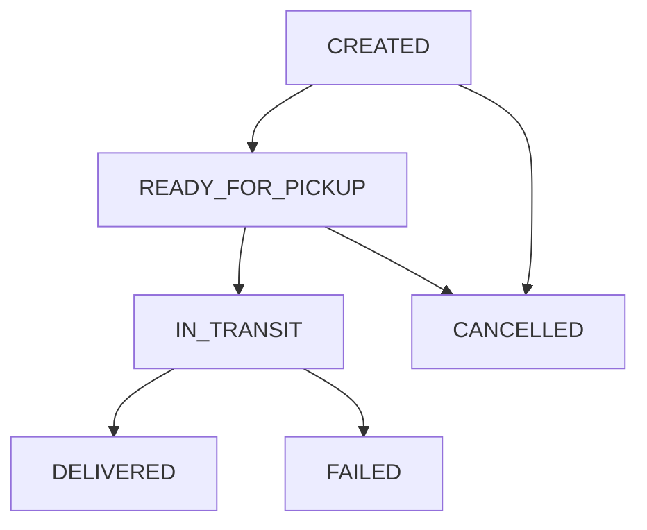

# SPRINT 4: COMMERCE RUNTIME
## Specyfikacja Kontraktu — 06_SHIPPING_ENGINE.md
*Definicja silnika wysyłek (Shipping Engine), maszyn stanów dostaw, adaptera dostawców wysyłkowych oraz reguł izolacji tenantów przy doręczeniach.*

---

### 1. Model Domenowy Wysyłek (Shipping Domain Model)

Wszystkie metody wysyłki, cenniki oraz same paczki (`Shipment`) są powiązane z konkretnym tenantem (`tenantId`).

```typescript
export interface ShippingMethod {
  id: string;
  tenantId: string;
  name: string;          // np. "Paczkomat InPost", "Kurier DHL"
  code: string;          // np. "inpost_paczkomat", "dhl_courier"
  carrier: string;       // np. "INPOST", "DHL"
  priceGross: number;    // Cena dla klienta w groszach
  isActive: boolean;
}

export type ShipmentStatus = 
  | 'CREATED' 
  | 'READY_FOR_PICKUP' 
  | 'IN_TRANSIT' 
  | 'DELIVERED' 
  | 'FAILED' 
  | 'CANCELLED';

export interface Shipment {
  id: string;
  tenantId: string;
  orderId: string;
  shippingMethodId: string;
  status: ShipmentStatus;
  trackingNumber?: string;
  labelUrl?: string;
  recipientAddress: {
    fullName: string;
    street: string;
    city: string;
    zipCode: string;
    country: string;
  };
  createdAt: string;
  updatedAt: string;
}
```

---

### 2. Adapter Dostawców Wysyłkowych (Shipping Provider Adapter)

Wysyłki są realizowane za pomocą uniwersalnego adaptera. Umożliwia to prostą integrację z InPost, DHL, DPD bez zmiany logiki biznesowej silnika.

```typescript
export interface LabelGenerationResult {
  trackingNumber: string;
  labelUrl: string;
}

export interface ShippingProviderAdapter {
  getCarrierCode(): string; // np. "DHL", "INPOST"
  createShipment(shipment: Shipment): Promise<LabelGenerationResult>;
}
```

---

### 3. Architektura Silnika Wysyłek (Shipping Engine)

Klasa `ShippingEngine` koordynuje proces nadawania przesyłek, pobierania etykiet i śledzenia drogi przesyłki.

#### Główne metody:
1. **`createShipment(tenantId: string, orderId: string, shippingMethodId: string, recipientAddress: Shipment['recipientAddress']): Promise<Shipment>`**
   * Waliduje istnienie metody wysyłki.
   * Tworzy obiekt `Shipment` w stanie `CREATED`.
   * Emituje `Shipping.Created`.
2. **`generateLabel(tenantId: string, shipmentId: string): Promise<Shipment>`**
   * Pobiera odpowiedni `ShippingProviderAdapter` na podstawie carrier_code.
   * Wywołuje `adapter.createShipment()`.
   * Przypisuje `trackingNumber` i `labelUrl` do paczki.
   * Zmienia status na `READY_FOR_PICKUP`.
   * Emituje `Shipping.LabelGenerated`.
3. **`updateStatus(tenantId: string, shipmentId: string, nextStatus: ShipmentStatus): Promise<Shipment>`**
   * Waliduje poprawne przejścia maszyny stanów przesyłki.
   * Emituje odpowiednie zdarzenie w zależności od nowego statusu (np. `Shipping.Dispatched` dla `IN_TRANSIT`, `Shipping.Delivered` dla `DELIVERED`, `Shipping.Failed` dla `FAILED`).

---

### 4. Maszyna Stanów Przesyłki (Shipment State Machine)

Dozwolone przejścia statusów w silniku:


Próba wykonania przejścia spoza tego grafu rzuca błąd `InvalidShipmentStateException`.

---

### 5. Izolacja Wielodostępności (Tenant Isolation)

Zasoby przesyłek, metody dostawy oraz adaptery są ścisle izolowane. Próba operowania na przesyłce innego tenanta kończy się natychmiastowym zgłoszeniem `TenantSecurityException`.

---

### 6. Kontrakt Testowy (Test Contract)

Implementacja silnika wysyłkowego w pliku `shipping-engine.test.ts` musi zweryfikować:

1. **Szczęśliwą ścieżkę (Happy Path)**:
   * Utworzenie wysyłki ➔ generowanie etykiety (Mock adapter) ➔ przejście do `READY_FOR_PICKUP` (z tracking number) ➔ `IN_TRANSIT` ➔ `DELIVERED`.
2. **Walidację maszyny stanów**:
   * Próba przejścia z `CREATED` bezpośrednio do `DELIVERED` rzuca `InvalidShipmentStateException`.
3. **Izolację wielodostępności (RLS)**:
   * Próba wygenerowania etykiety dla przesyłki należącej do innego tenanta rzuca `TenantSecurityException`.
4. **Zdarzenia szyny Event Bus**:
   * Pomyślna generacja etykiety i doręczenie publikują odpowiednio `Shipping.LabelGenerated` i `Shipping.Delivered`.
